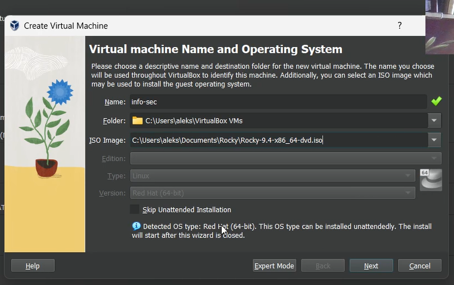
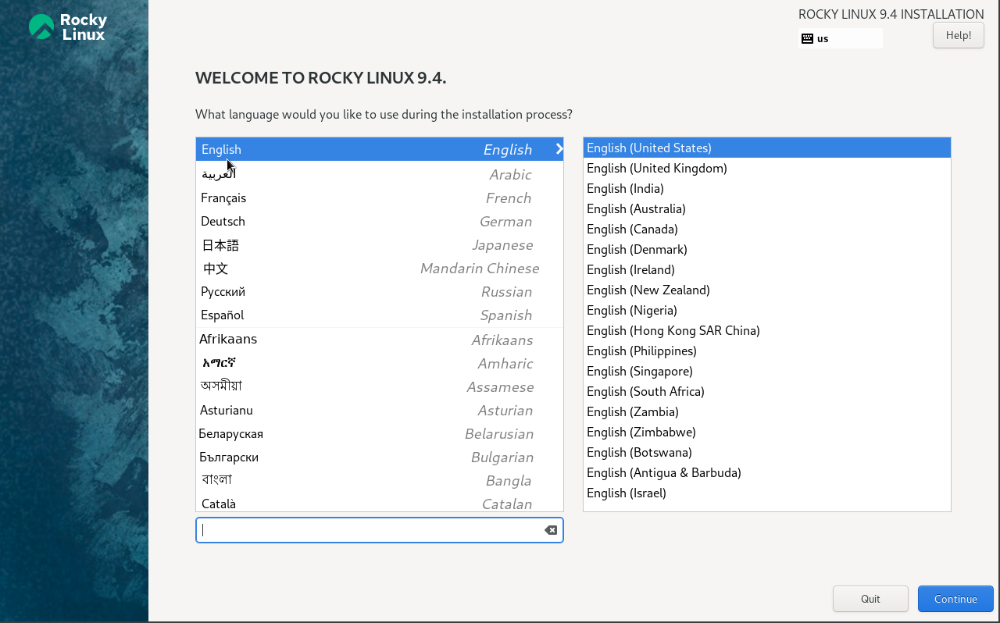
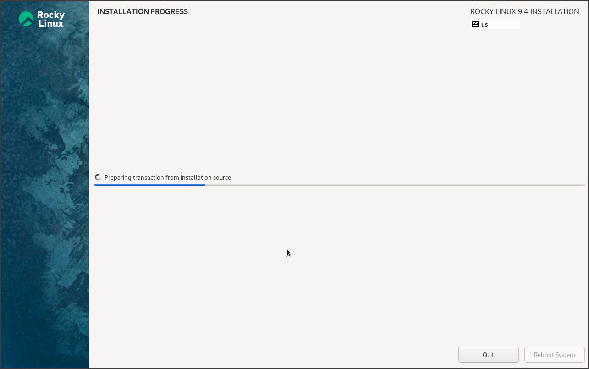
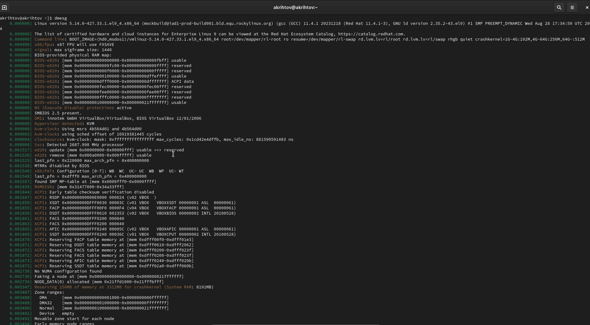
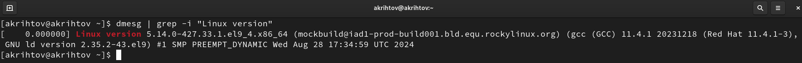
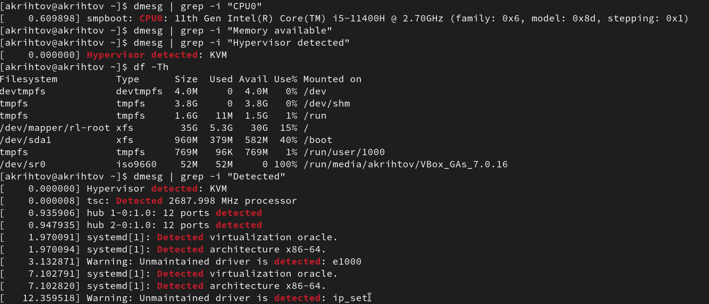
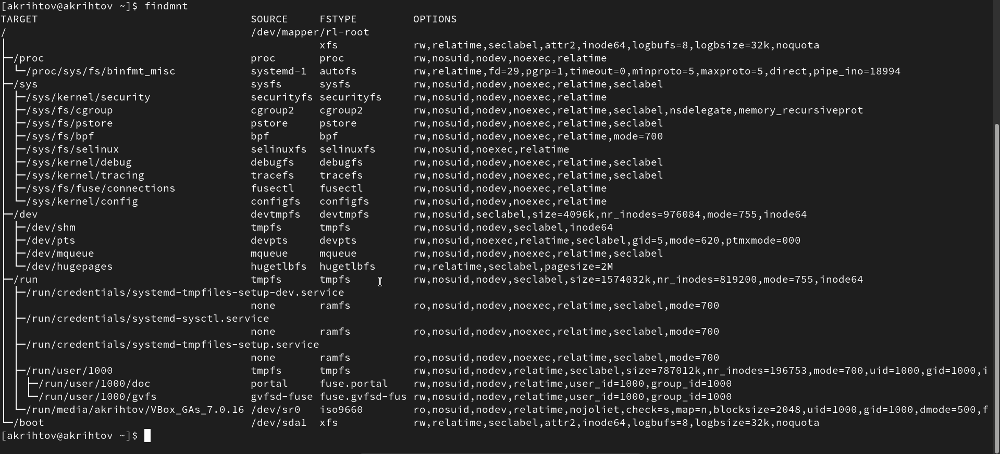

---
## Front matter
title: "Отчет по лабораторной работе №1"
subtitle: "Установка и конфигурация
операционной системы на виртуальную машину"
author: "Рытов Алексей"

## Generic otions
lang: ru-RU
toc-title: "Содержание"

## Pdf output format
toc: true # Table of contents
toc-depth: 2
#lof: true # List of figures
#lot: true # List of tables
fontsize: 12pt
linestretch: 1.5
papersize: a4
documentclass: scrreprt
## I18n polyglossia
polyglossia-lang:
  name: russian
  options:
	- spelling=modern
	- babelshorthands=true
polyglossia-otherlangs:
  name: english
## I18n babel
babel-lang: russian
babel-otherlangs: english
## Fonts
mainfont: DejaVu Serif
romanfont: DejaVu Serif
sansfont: DejaVu Sans
monofont: DejaVu Sans Mono
mathfont: STIX Two Math
mainfontoptions: Ligatures=Common,Ligatures=TeX,Scale=0.94
romanfontoptions: Ligatures=Common,Ligatures=TeX,Scale=0.94
sansfontoptions: Ligatures=Common,Ligatures=TeX,Scale=MatchLowercase,Scale=0.94
monofontoptions: Scale=MatchLowercase,Scale=0.94,FakeStretch=0.9
mathfontoptions:

## Misc options
indent: true
header-includes:
  - \usepackage{indentfirst}
  - \usepackage{float} # keep figures where there are in the text
  - \floatplacement{figure}{H} # keep figures where there are in the text
---

# Цель работы

Целью данной работы является приобретение практических навыков
установки операционной системы на виртуальную машину, настройки ми
нимально необходимых для дальнейшей работы сервисов.

# Выполнение лабораторной работы

1. Первым шагом создали виртуальную машину с ISO образом дистрибутива Rocky-9.4 (рис. 1).

{#fig:1 width=70%}

2. Изменили настройки установки операционной системы под себя и начали установку операционнуй системы (рис. 2-3).

{#fig:002 width=70%}

{#fig:003 width=70%}

3. Завершили установку и перезагрузили виртуальную машину (рис. 4).

{#fig:004 width=70%}

4. Выполнили домашнее задание представденное в лабораторной работе:
- продемонстрировали работу команды dmesg (рис. 5)
- получили следующую информацию: версию ядра Linux (Linux version),
частоту процессора (Detected Mhz processor), модель процессора (CPU0),
объем доступной оперативной памяти (Memory available), тип обнаруженного гипервизора (Hypervisor detected), тип файловой системы корневого раздела, последовательность монтирования файловых систем (рис. 6-9).

{#fig:005 width=70%}

{#fig:006 width=70%}

{#fig:008 width=70%}

{#fig:009 width=70%}

# Выводы

Мы успешно научились устанавливать дистрибутивы линукса на виртуальную машину.
