---
## Front matter
lang: ru-RU
title: Презентация №2 
subtitle: по Лаборатрной работе №2 
author:
  - Рытов Алексей

## Formatting pdf
toc: false
toc-title: Содержание
slide_level: 2
aspectratio: 169
section-titles: true

mainfont: DejaVu Serif
romanfont: DejaVu Serif
sansfont: DejaVu Sans
monofont: DejaVu Sans Mono
mathfont: STIX Two Math
---

# Цель работы

Получение практических навыков работы в консоли с атрибутами фай-
лов, закрепление теоретических основ дискреционного разграничения до-
ступа в современных системах с открытым кодом на базе ОС Linux.

# Выполнение лабораторной работы

1. Первым шагом создали учётную запись пользователя guest (рис. 1).

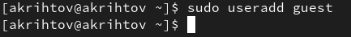{#fig:1 width=70%}

---

2. Задали пароль для пользователя guest (рис. 2).

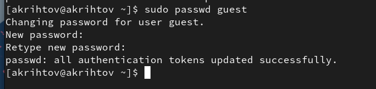{#fig:002 width=70%}

---

3. Вошли в систему от имени пользователя guest (рис. 3).

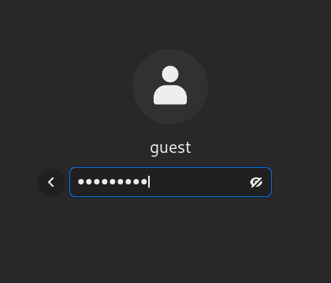{#fig:003 width=70%}

---

4. Определили директорию, в которой мы находимся, командой pwd (рис. 4).

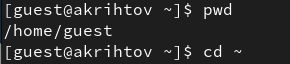{#fig:004 width=70%}

---

5. Уточнили имя пользователя командой whoami (рис. 5).

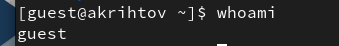{#fig:005 width=70%}

---

6. Воспользовались командой id (рис. 6).

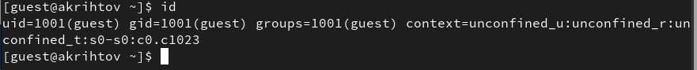{#fig:006 width=70%}

---

7. Сравнили полученную информацию об имени пользователя с данными,
выводимыми в приглашении командной строки.

8. Просмотрели файл /etc/passwd командой cat (рис. 7).

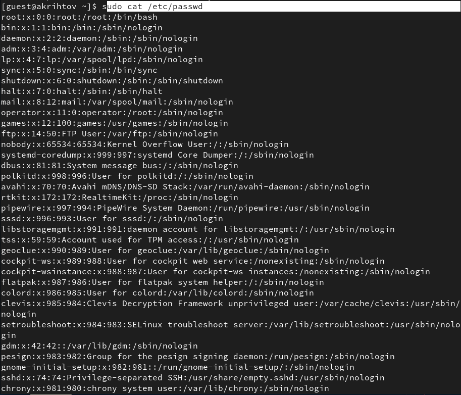{#fig:007 width=70%}

---

9. Определили существующие в системе директории командой
 ls -l /home/ (рис. 8).

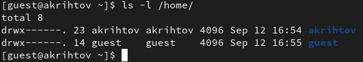{#fig:008 width=70%}

---

10. Воспользовались командой lsattr /home (рис. 9).

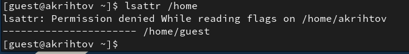{#fig:009 width=70%}

---

11. Создали в домашней директории поддиректорию dir1 командой
mkdir dir1. Определили командами ls -l и lsattr, какие права доступа и расширенные атрибуты были выставлены на директорию dir1 (рис. 10-11).

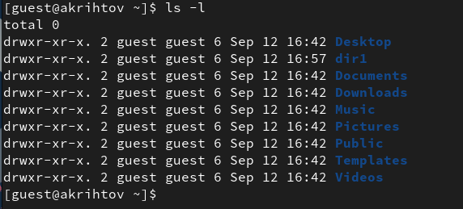{#fig:010 width=70%}

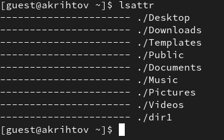{#fig:011 width=70%}

---

12. Сняли с директории все атрибуты (рис. 12).

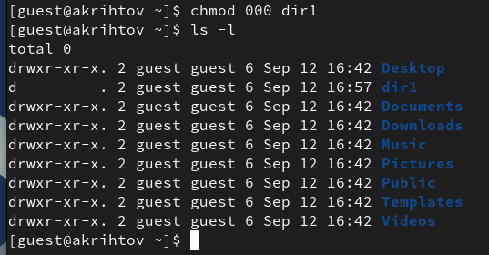{#fig:012 width=70%}

---

13. Попытались создать в директории dir1 файл file1 командой
echo "test" > /home/guest/dir1/file1 (рис. 13-14).

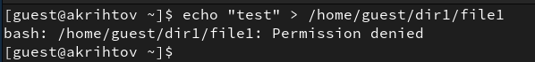{#fig:013 width=70%}

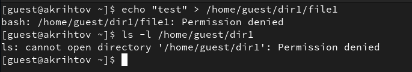{#fig:014 width=70%}

# Выводы

Мы успешно выполнили лабораторную работу и получили навыки работы в консоли с атрибутами файлов.