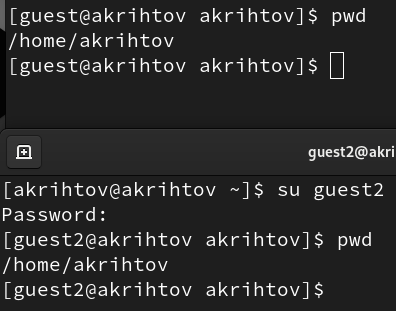

---
## Front matter
lang: ru-RU
title: Презентация №3 
subtitle: по Лаборатрной работе №3 
author:
  - Рытов Алексей

## Formatting pdf
toc: false
toc-title: Содержание
slide_level: 2
aspectratio: 169
section-titles: true

mainfont: DejaVu Serif
romanfont: DejaVu Serif
sansfont: DejaVu Sans
monofont: DejaVu Sans Mono
mathfont: STIX Two Math
---

# Цель работы

Получение практических навыков работы в консоли с атрибутами файлов
для групп пользователей.

# Выполнение лабораторной работы

1. Так как учетная запись guest у нас уже была создана с предыдущей
   лабораторной работы, то мы сразу перешли к выполнению пункта 3, а именно
   создали учётную запись пользователя guest2, а также добавили
   пользователя guest2 в группу guest (рис. 1).

{#fig:1 width=70%}

---

2. Осуществили вход от двух пользователей в разных терминалах (рис. 2).

{#fig:002 width=70%}

---

3. Определили директорию, в которой мы находимся, командой pwd (рис. 3).

{#fig:003 width=70%}

---

5. Уточнили имя пользователя командой whoami и группы
   пользователей (рис. 4).

{#fig:004 width=70%}

---

6. Сравнили полученную информацию с содержимым файла /etc/group (рис. 5).

{#fig:005 width=70%}

---

7. Выполнили регистрацию пользователя (рис. 6).

{#fig:006 width=70%}

---

8. Изменили права директории /home/guest (рис. 7).

{#fig:007 width=70%}

---

9. Сняли с директории /home/guest/dir1 все атрибуты (рис. 8).

{#fig:008 width=70%}

# Выводы

Мы успешно выполнили лабораторную работу и получили навыки работы в консоли с атрибутами файлов
для групп пользователей.
