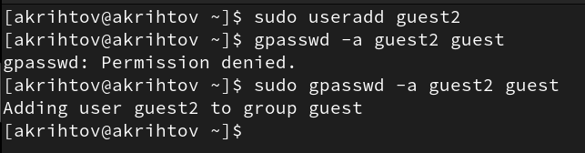
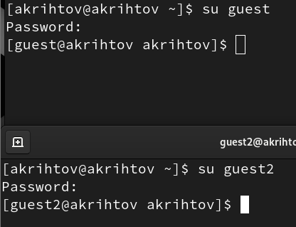
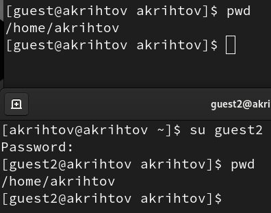
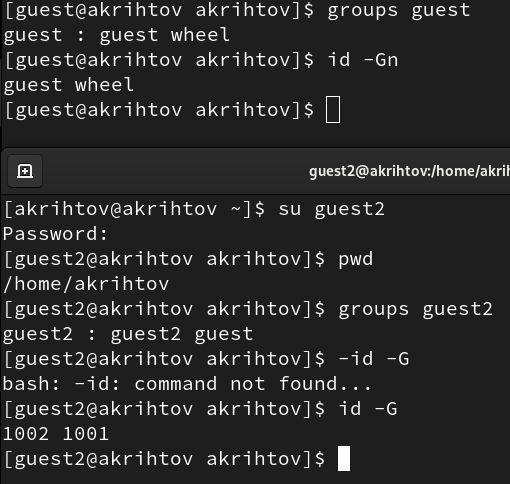
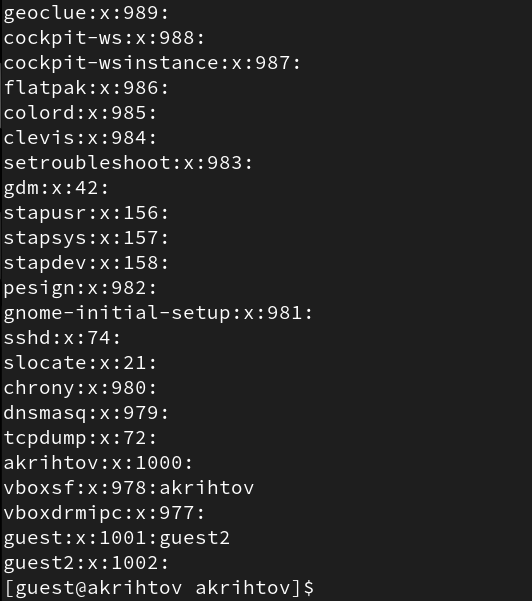
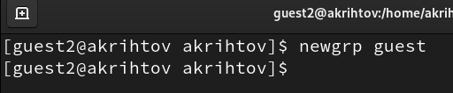
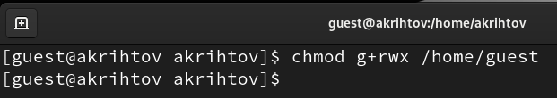
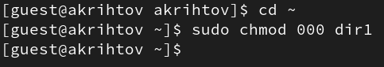

---
## Front matter
title: "Отчет по лабораторной работе №3"
subtitle: "Дискреционное
разграничение прав в Linux. Два пользователя"
author: "Рытов Алексей"

## Generic otions
lang: ru-RU
toc-title: "Содержание"

## Pdf output format
toc: true # Table of contents
toc-depth: 2
#lof: true # List of figures
#lot: true # List of tables
fontsize: 12pt
linestretch: 1.5
papersize: a4
documentclass: scrreprt
## I18n polyglossia
polyglossia-lang:
  name: russian
  options:
	- spelling=modern
	- babelshorthands=true
polyglossia-otherlangs:
  name: english
## I18n babel
babel-lang: russian
babel-otherlangs: english
## Fonts
mainfont: DejaVu Serif
romanfont: DejaVu Serif
sansfont: DejaVu Sans
monofont: DejaVu Sans Mono
mathfont: STIX Two Math
mainfontoptions: Ligatures=Common,Ligatures=TeX,Scale=0.94
romanfontoptions: Ligatures=Common,Ligatures=TeX,Scale=0.94
sansfontoptions: Ligatures=Common,Ligatures=TeX,Scale=MatchLowercase,Scale=0.94
monofontoptions: Scale=MatchLowercase,Scale=0.94,FakeStretch=0.9
mathfontoptions:

## Misc options
indent: true
header-includes:
  - \usepackage{indentfirst}
  - \usepackage{float} # keep figures where there are in the text
  - \floatplacement{figure}{H} # keep figures where there are in the text
---

# Цель работы

Получение практических навыков работы в консоли с атрибутами файлов
для групп пользователей.

# Выполнение лабораторной работы

1. Так как учетная запись guest у нас уже была создана с предыдущей
лабораторной работы, то мы сразу перешли к выполнению пункта 3, а именно
создали учётную запись пользователя guest2, а также добавили
пользователя guest2 в группу guest (рис. 1).

{#fig:1 width=70%}

2. Осуществили вход от двух пользователей в разных терминалах (рис. 2).

{#fig:002 width=70%}

3. Определили директорию, в которой мы находимся, командой pwd (рис. 3).

{#fig:003 width=70%}

5. Уточнили имя пользователя командой whoami и группы
пользователей (рис. 4).

{#fig:004 width=70%}

6. Сравнили полученную информацию с содержимым файла /etc/group (рис. 5).

{#fig:005 width=70%}

7. Выполнили регистрацию пользователя (рис. 6).

{#fig:006 width=70%}

8. Изменили права директории /home/guest (рис. 7).

{#fig:007 width=70%}

9. Сняли с директории /home/guest/dir1 все атрибуты (рис. 8).

{#fig:008 width=70%}

И заполнили таблицы:

|   Права директории   |      Права файла     | Создание файла| Удаление файла | Запись в файл | Чтение файла | Смена директории | Просмотр файлов в директории | Переименование файл | Смена атрибутов файла |
|:---------------------|:---------------------|-----|-----|-----|-----|-----|-----|-----|-----|
|```d--------- (000)```|```---------- (000)```|  -	|  -  |  -  |  -  |  -	|  -  |  -  |  -  |
|```d-----x--- (010)```|```---------- (000)```|  -	|  -  |	 -	|  -  |  +  |  -  |  -  |  +  |
|```d----w---- (020)```|```---------- (000)```|  -	|  -  |	 -  |  -  |  -	|  -  |  -  |  -  |
|```d----wx--- (030)```|```---------- (000)```|  +	|  +  |  -	|  -  |  +  |  -  |  +  |  +  |
|```d---r----- (040)```|```---------- (000)```|  -	|  -  |	 -  |  -  |  -	|  +  |  -  |  -  |
|```d---r-x--- (050)```|```---------- (000)```|  -	|  -  |  -	|  -  |  +  |  +  |  -  |  +  |
|```d---rw---- (060)```|```---------- (000)```|  -	|  -  |  -  |  -  |  -	|  +  |  -  |  -  |
|```d---rwx--- (070)```|```---------- (000)```|  +	|  +  |	 -	|  -  |  +	|  +  |  +  |  +  |
|```d--------- (000)```|```------x--- (010)```|  -	|  -  |  -  |  -  |  -	|  -  |  -  |  -  |
|```d-----x--- (010)```|```------x--- (010)```|  -  |  -  |	 -	|  -  |  +	|  -  |  -  |  +  |
|```d----w---- (020)```|```------x--- (010)```|  -	|  -  |  -  |  -  |  -	|  -  |  -  |  -  |
|```d----wx--- (030)```|```------x--- (010)```|  +	|  +  |	 -	|  -  |  +	|  -  |  +  |  +  |
|```d---r----- (040)```|```------x--- (010)```|  -	|  -  |  -  |  -  |  -	|  +  |  -  |  -  |
|```d---r-x--- (050)```|```------x--- (010)```|  -	|  -  |	 -	|  -  |  +	|  +  |  -  |  +  |
|```d---rw---- (060)```|```------x--- (010)```|  -	|  -  |  -  |  -  |  -	|  +  |  -  |  -  |
|```d---rwx--- (070)```|```------x--- (010)```|  +	|  +  |	 -	|  -  |  +	|  +  |  +  |  +  |
|```d--------- (000)```|```-----w---- (020)```|  -	|  -  |  -  |  -  |  -	|  -  |  -  |  -  |
|```d-----x--- (010)```|```-----w---- (020)```|  -	|  -  |	 +	|  -  |  +	|  -  |  -  |  +  |
|```d----w---- (020)```|```-----w---- (020)```|  -	|  -  |  -  |  -  |  -	|  -  |  -  |  -  |
|```d----wx--- (030)```|```-----w---- (020)```|  +	|  +  |	 +	|  -  |  +	|  -  |  +  |  +  |
|```d---r----- (040)```|```-----w---- (020)```|  -	|  -  |  -  |  -  |  -	|  +  |  -  |  -  |
|```d---r-x--- (050)```|```-----w---- (020)```|  -	|  -  |	 +  |  -  |  +	|  +  |  -  |  +  |
|```d---rw---- (060)```|```-----w---- (020)```|  -	|  -  |  -  |  -  |  -	|  +  |  -  |  -  |
|```d---rwx--- (070)```|```-----w---- (020)```|  +	|  +  |	 +	|  -  |  +	|  +  |  +  |  +  |
|```d--------- (000)```|```-----wx--- (030)```|  -	|  -  |  -  |  -  |  -	|  -  |  -  |  -  |
|```d-----x--- (010)```|```-----wx--- (030)```|  -	|  -  |	 +	|  -  |  +	|  -  |  -  |  +  |
|```d----w---- (020)```|```-----wx--- (030)```|  -	|  -  |  -  |  -  |  -	|  -  |  -  |  -  |
|```d----wx--- (030)```|```-----wx--- (030)```|  +  |  +  |	 +  |  -  |  +  |  -  |  +  |  +  |
|```d---r----- (040)```|```-----wx--- (030)```|  -	|  -  |  -  |  -  |  -	|  +  |  -  |  -  |
|```d---r-x--- (050)```|```-----wx--- (030)```|  -  |  -  |	 +	|  -  |  +	|  +  |  -  |  +  |
|```d---rw---- (060)```|```-----wx--- (030)```|  -	|  -  |  -  |  -  |  -	|  +  |  -  |  -  |
|```d---rwx--- (070)```|```-----wx--- (030)```|  +	|  +  |	 +	|  -  |  +	|  +  |  +  |  +  |
|```d--------- (000)```|```----r----- (040)```|  -	|  -  |  -  |  -  |  -	|  -  |  -  |  -  |
|```d-----x--- (010)```|```----r----- (040)```|  -	|  -  |	 -	|  +  |  +	|  -  |  -  |  +  |
|```d----w---- (020)```|```----r----- (040)```|  -	|  -  |  -  |  -  |  -	|  -  |  -  |  -  |
|```d----wx--- (030)```|```----r----- (040)```|  +	|  +  |	 -	|  +  |  +	|  -  |  +  |  +  |
|```d---r----- (040)```|```----r----- (040)```|  -	|  -  |  -  |  -  |  -	|  +  |  -  |  -  |
|```d---r-x--- (050)```|```----r----- (040)```|  -  |  -  |	 -	|  +  |  +  |  +  |  -  |  +  |
|```d---rw---- (060)```|```----r----- (040)```|  -	|  -  |  -  |  -  |  -	|  +  |  -  |  -  |
|```d---rwx--- (070)```|```----r----- (040)```|  +	|  +  |	 -	|  +  |  +	|  +  |  +  |  +  |
|```d--------- (000)```|```----r-x--- (050)```|  -	|  -  |  -  |  -  |  -	|  -  |  -  |  -  |
|```d-----x--- (010)```|```----r-x--- (050)```|  -	|  -  |	 -	|  +  |  +	|  -  |  -  |  +  |
|```d----w---- (020)```|```----r-x--- (050)```|  -	|  -  |  -  |  -  |  -	|  -  |  -  |  -  |
|```d----wx--- (030)```|```----r-x--- (050)```|  +	|  +  |	 -  |  +  |  +	|  -  |  +  |  +  |
|```d---r----- (040)```|```----r-x--- (050)```|  -	|  -  |  -  |  -  |  -	|  +  |  -  |  -  |
|```d---r-x--- (050)```|```----r-x--- (050)```|  -	|  -  |	 -	|  +  |  +	|  +  |  -  |  +  |
|```d---rw---- (060)```|```----r-x--- (050)```|  -	|  -  |  -  |  -  |  -	|  +  |  -  |  -  |
|```d---rwx--- (070)```|```----r-x--- (050)```|  +	|  +  |	 -	|  +  |  +	|  +  |  +  |  +  |
|```d--------- (000)```|```----rw---- (060)```|  -	|  -  |  -  |  -  |  -	|  -  |  -  |  -  |
|```d-----x--- (010)```|```----rw---- (060)```|  -	|  -  |  +	|  +  |  +	|  -  |  -  |  +  |
|```d----w---- (020)```|```----rw---- (060)```|  -	|  -  |  -  |  -  |  -	|  -  |  -  |  -  |
|```d----wx--- (030)```|```----rw---- (060)```|  +	|  +  |	 +	|  +  |  +	|  -  |  +  |  +  |
|```d---r----- (040)```|```----rw---- (060)```|  -	|  -  |  -  |  -  |  -	|  +  |  -  |  -  |
|```d---r-x--- (050)```|```----rw---- (060)```|  -  |  -  |	 +	|  +  |  +	|  +  |  -  |  +  |
|```d---rw---- (060)```|```----rw---- (060)```|  -	|  -  |  -  |  -  |  -	|  +  |  -  |  -  |
|```d---rwx--- (070)```|```----rw---- (060)```|  +  |  +  |	 +	|  +  |  +	|  +  |  +  |  +  |
|```d--------- (000)```|```----rwx--- (070)```|  -	|  -  |  -  |  -  |  -	|  -  |  -  |  -  |
|```d-----x--- (010)```|```----rwx--- (070)```|  -  |  -  |	 +	|  +  |  +	|  -  |  -  |  +  |
|```d----w---- (020)```|```----rwx--- (070)```|  -	|  -  |  -  |  -  |  -	|  -  |  -  |  -  |
|```d----wx--- (030)```|```----rwx--- (070)```|  +  |  +  |	 +	|  +  |  +	|  -  |  +  |  +  |
|```d---r----- (040)```|```----rwx--- (070)```|  -	|  -  |  -  |  -  |  -	|  +  |  -  |  -  |
|```d---r-x--- (050)```|```----rwx--- (070)```|  -  |  -  |	 +	|  +  |  +	|  +  |  -  |  +  |
|```d---rw---- (060)```|```----rwx--- (070)```|  -	|  -  |  -  |  -  |  -	|  +  |  -  |  -  |
|```d---rwx--- (070)```|```----rwx--- (070)```|  +  |  +  |	 +	|  +  |  +	|  +  |  +  |  +  |


|        Операция        | Права на директорию | Права на файл |
|------------------------|---------------------------------|---------------------------|
|     Создание файла     |           ```d----wx--- (030)```      |      ```---------- (000)```     |	    
|     Удаление файла     |           ```d----wx--- (030)```      |      ```---------- (000)```     |
|      Чтение файла      |           ```d-----x--- (010)```      |      ```----r----- (040)```     |
|      Запись в файл     |           ```d-----x--- (010)```      |      ```-----w---- (020)```     |
|  Переименование файла  |           ```d----wx--- (030)```      |      ```---------- (000)```     |
| Создание поддиректории |           ```d----wx--- (030)```      |      ```---------- (000)```     |
| Удаление поддиректории |           ```d----wx--- (030)```      |      ```---------- (000)```     |

# Выводы

Мы успешно выполнили лабораторную работу и получили навыки работы в консоли с атрибутами файлов
для групп пользователей.
