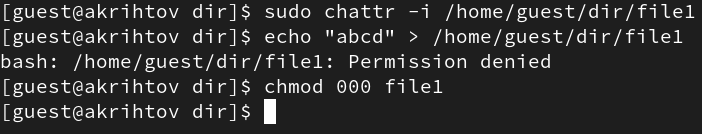

---
## Front matter
lang: ru-RU
title: Презентация №4 
subtitle: по Лаборатрной работе №4 
author:
  - Рытов Алексей

## Formatting pdf
toc: false
toc-title: Содержание
slide_level: 2
aspectratio: 169
section-titles: true

mainfont: DejaVu Serif
romanfont: DejaVu Serif
sansfont: DejaVu Sans
monofont: DejaVu Sans Mono
mathfont: STIX Two Math
---

# Цель работы

Получение практических навыков работы в консоли с расширенными
атрибутами файлов.

# Выполнение лабораторной работы

1. От имени пользователя guest определили расширенные атрибуты файла
   /home/guest/dir1/file1 командой lsattr /home/guest/dir1/file1 (рис. 1).

{#fig:1 width=70%}

---

2. Установили командой chmod 600 file1 на файл file1 права, разрешающие
   чтение и запись для владельца файла. (рис. 2).

{#fig:002 width=70%}

---

3. Попробовали установить на файл /home/guest/dir1/file1 расширенный
   атрибут a от имени пользователя guest:
   chattr +a /home/guest/dir1/file1 (рис. 3).

{#fig:003 width=70%}

---

4. Попробовали установить расширенный атрибут a на файл
   /home/guest/dir1/file1 от имени суперпользователя (рис. 4).

{#fig:004 width=70%}

---

5. От пользователя guest проверьте правильность установления
   атрибута (рис. 5).

{#fig:005 width=70%}

---

6. Выполнили дозапись в файл file1 слова «test» (рис. 6).

{#fig:006 width=70%}

---

7. Попробовали удалить файл file1 либо стереть имеющуюся в нём
   информацию командой (рис. 7).

{#fig:007 width=70%}

---

8. Попробуйте с помощью команды установить на файл file1 права,
   например, запрещающие чтение и запись для владельца файла (рис. 8).

{#fig:008 width=70%}

---

9. Сняли расширенный атрибут a с файла /home/guest/dirl/file1 от
   имени суперпользователя (рис. 9).

{#fig:009 width=70%}

---

10. Повторили наши действия по шагам, заменив атрибут «a»
    атрибутом «i» (рис. 10).

{#fig:010 width=70%}

# Выводы

В результате выполнения работы вы повысили свои навыки использования
интерфейса командой строки (CLI), познакомились на примерах с тем,
как используются основные и расширенные атрибуты при разграничении
доступа. Имели возможность связать теорию дискреционного разделения
доступа (дискреционная политика безопасности) с её реализацией на
практике в ОС Linux. 
