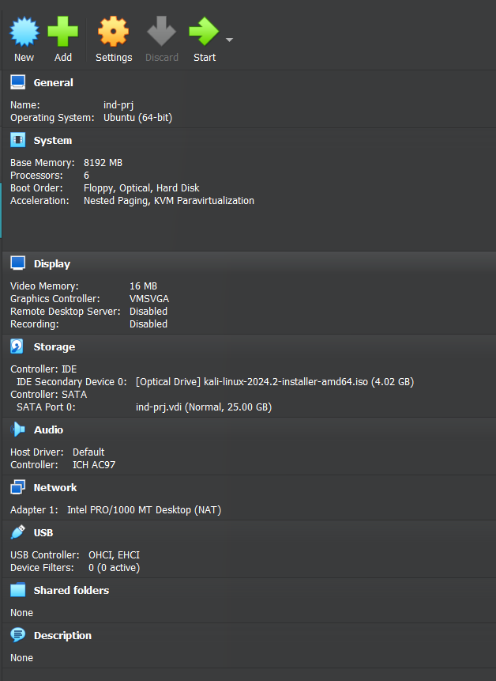
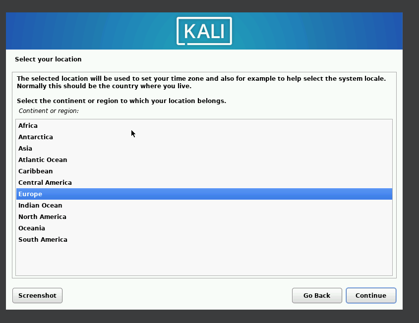
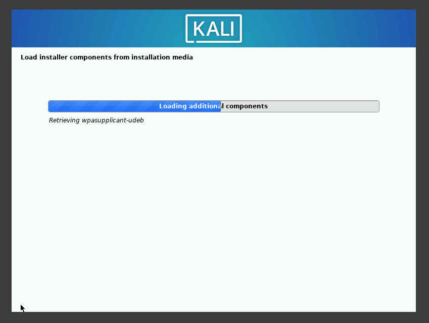
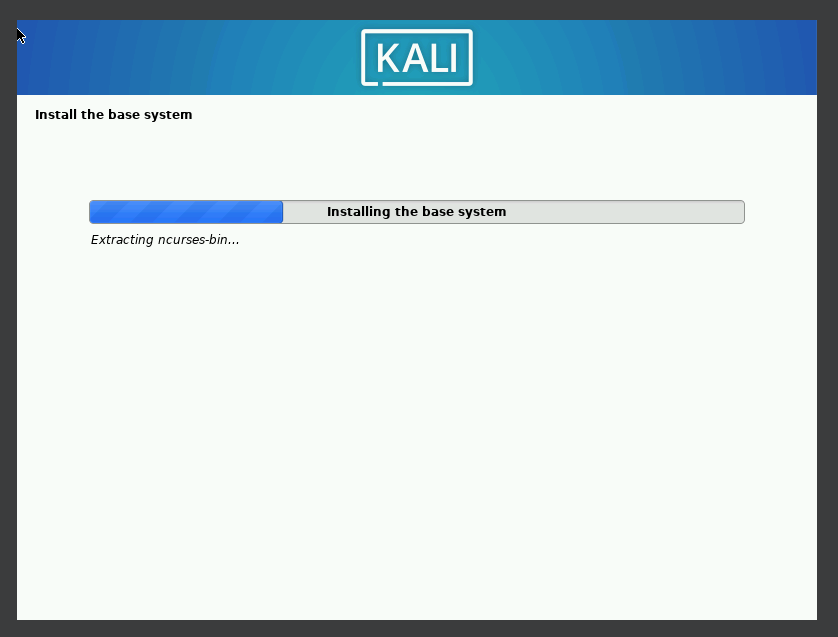
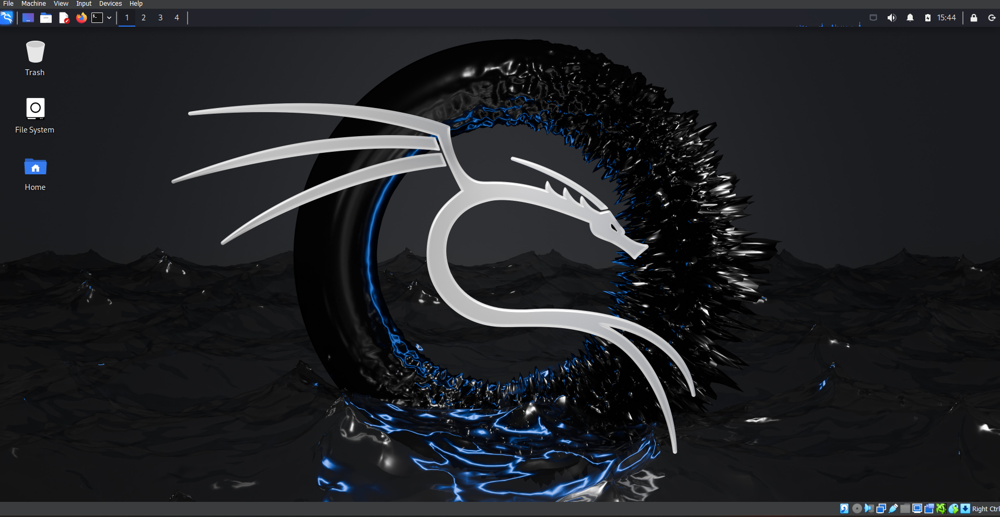

---
## Front matter
lang: ru-RU
title: Презентация №1 
subtitle: по Этапу проекта №1 
author:
  - Рытов Алексей

## Formatting pdf
toc: false
toc-title: Содержание
slide_level: 2
aspectratio: 169
section-titles: true

mainfont: DejaVu Serif
romanfont: DejaVu Serif
sansfont: DejaVu Sans
monofont: DejaVu Sans Mono
mathfont: STIX Two Math
---
# Цель работы

Целью данной работы является приобретение практических навыков
установки операционной системы на виртуальную машину, настройки ми
нимально необходимых для дальнейшей работы сервисов.

# Выполнение лабораторной работы

1. Первым шагом создали виртуальную машину с ISO образом дистрибутива Kali Linux (рис. 1).

{#fig:1 width=70%}

---

2. Изменили настройки установки операционной системы под себя и начали установку операционнуй системы (рис. 2-3).

{#fig:002 width=70%}

---

{#fig:003 width=70%}

---

{#fig:004 width=70%}

---

3. Завершили установку и перезагрузили виртуальную машину (рис. 4).

{#fig:005 width=70%}

# Выводы

Мы успешно научились устанавливать дистрибутивы линукса на виртуальную машину.
