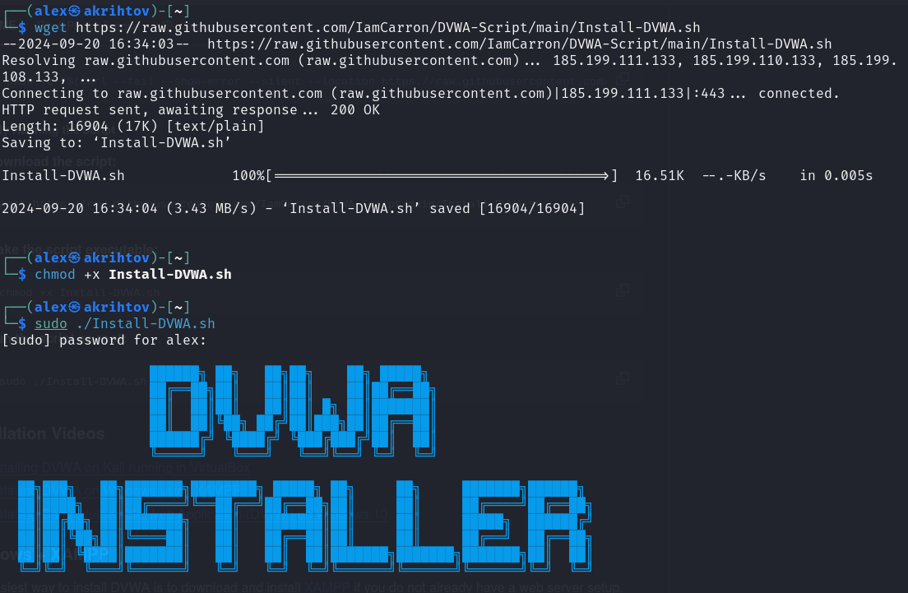
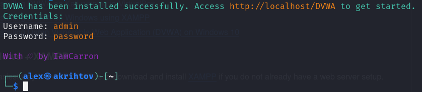
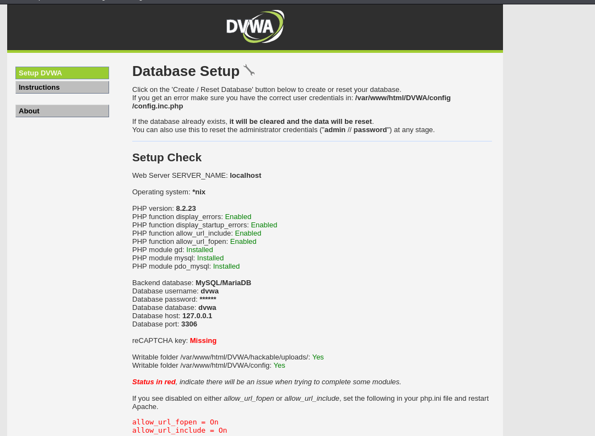

---
## Front matter
lang: ru-RU
title: Презентация №2 
subtitle: по Этапу проекта №2 
author:
  - Рытов Алексей

## Formatting pdf
toc: false
toc-title: Содержание
slide_level: 2
aspectratio: 169
section-titles: true

mainfont: DejaVu Serif
romanfont: DejaVu Serif
sansfont: DejaVu Sans
monofont: DejaVu Sans Mono
mathfont: STIX Two Math
---

# Цель работы

Целью данной работы является приобретение практических навыков
работы в операционной системе Kali Linux, а также установке
и настройке DVWA.

# Выполнение лабораторной работы

1. Запустили установочный скрипт DVWA (рис. 1).

{#fig:1 width=70%}

---

2. Подтвердили, что DVWA установилось корректно (рис. 2).

{#fig:002 width=70%}

---

3. Завершили установку и перешли на localhost/setup.sh для
   проверки корректной работы (рис. 3).

{#fig:003 width=70%}

# Выводы

Мы успещно приобрели практические навыки работы
в операционной системе Kali Linux, а также установки
и настройки DVWA.
