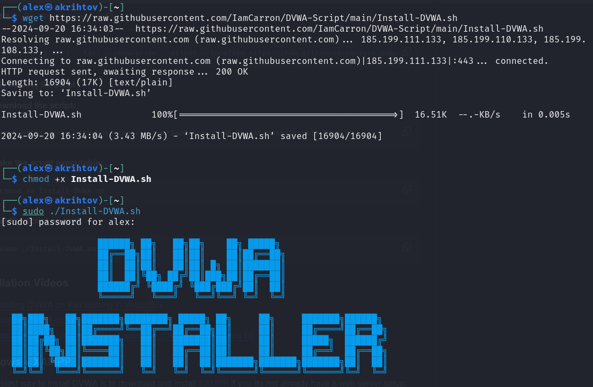
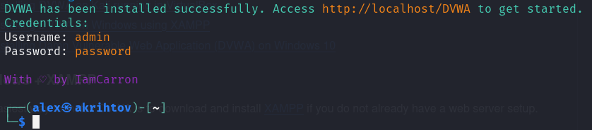
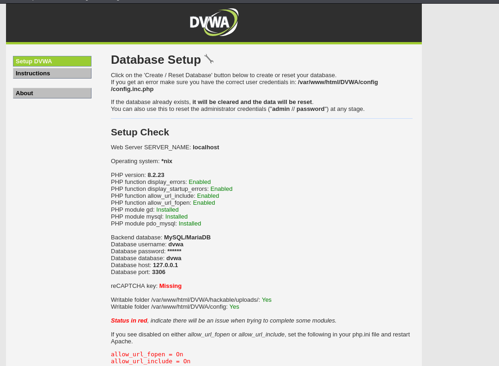

---
## Front matter
title: "Отчет по этапу проекта №2"
subtitle: "Установка DVWA"
author: "Рытов Алексей"

## Generic otions
lang: ru-RU
toc-title: "Содержание"

## Pdf output format
toc: true # Table of contents
toc-depth: 2
#lof: true # List of figures
#lot: true # List of tables
fontsize: 12pt
linestretch: 1.5
papersize: a4
documentclass: scrreprt
## I18n polyglossia
polyglossia-lang:
  name: russian
  options:
	- spelling=modern
	- babelshorthands=true
polyglossia-otherlangs:
  name: english
## I18n babel
babel-lang: russian
babel-otherlangs: english
## Fonts
mainfont: DejaVu Serif
romanfont: DejaVu Serif
sansfont: DejaVu Sans
monofont: DejaVu Sans Mono
mathfont: STIX Two Math
mainfontoptions: Ligatures=Common,Ligatures=TeX,Scale=0.94
romanfontoptions: Ligatures=Common,Ligatures=TeX,Scale=0.94
sansfontoptions: Ligatures=Common,Ligatures=TeX,Scale=MatchLowercase,Scale=0.94
monofontoptions: Scale=MatchLowercase,Scale=0.94,FakeStretch=0.9
mathfontoptions:

## Misc options
indent: true
header-includes:
  - \usepackage{indentfirst}
  - \usepackage{float} # keep figures where there are in the text
  - \floatplacement{figure}{H} # keep figures where there are in the text
---

# Цель работы

Целью данной работы является приобретение практических навыков
работы в операционной системе Kali Linux, а также установке 
и настройке DVWA.

# Выполнение лабораторной работы

1. Запустили установочный скрипт DVWA (рис. 1).

{#fig:1 width=70%}

2. Подтвердили, что DVWA установилось корректно (рис. 2).

{#fig:002 width=70%}

3. Завершили установку и перешли на localhost/setup.sh для
 проверки корректной работы (рис. 3).

{#fig:003 width=70%}

# Выводы

Мы успещно приобрели практические навыки работы
в операционной системе Kali Linux, а также установки
и настройки DVWA.
